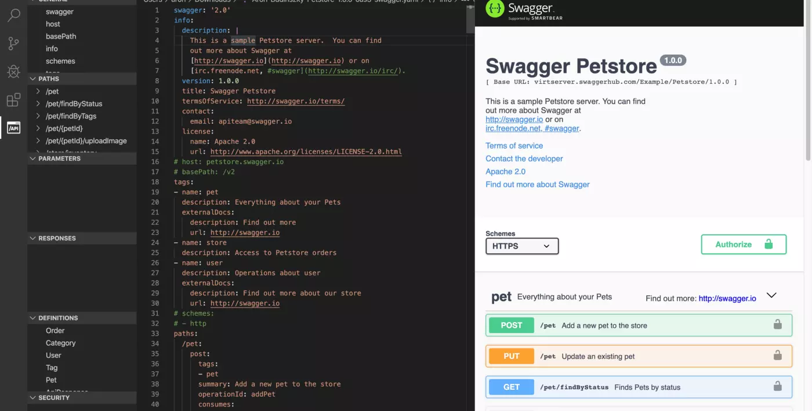

## What is Swagger and OpenAPI?

Swagger is a tool for designing, building, documenting, and mocking APIs. It uses the OpenAPI specification (yaml or json files) to describe requests, responses, and any other details about your RESTful APIs.

Using this spec you can then generate documentation and even create a mock server.

## Setting up Visual Studio Code

Microsoft’s free [Visual Studio Code](https://code.visualstudio.com/) provides a great set of tools to create, edit, and verify your OpenAPI spec files. After installing VSCode you should install these Extensions (unsurprisingly using the _Extensions_ button on the left):

- YAML ([link](https://marketplace.visualstudio.com/items?itemName=redhat.vscode-yaml))
- Swagger Viewer ([link](https://marketplace.visualstudio.com/items?itemName=Arjun.swagger-viewer))
- OpenAPI Swagger Editor ([link](https://marketplace.visualstudio.com/items?itemName=42Crunch.vscode-openapi))
- Swagger Snippets ([link](https://marketplace.visualstudio.com/items?itemName=adisreyaj.swagger-snippets), optional)

Once you create a yaml (or json) file and add the basic OpenAPI structure, the API icon will appear on the left and you’ll have the option to preview the documentation using _Shift+Option+P_.



## Create and edit your OpenAPI spec files

First off, create a \*.yaml file. (I will be demonstrating examples in YAML, but JSON is also supported if you are more comfortable with that standard.)

Although you can [browse through the specs](https://swagger.io/specification/), it’s probably best to start with a simple example — this describes a fictional API for the ubiquitous “Todo app”:

```yaml
openapi: 3.0.0
info:
  title: Example Task Manager Project
  description: An example API documentation for a task manager.
  version: "1.0"
servers:
  - url: "https://example.com/taskmanager/"
components:
  schemas:
    Task:
      type: object
      properties:
        title:
          type: string
          example: "Buy eggs"
          description: "The description task to be done."
        completed:
          type: boolean
          example: true
          description: "True or false to mark whether the task has been completed."
        id:
          type: integer
          example: 3
          description: "A unique identifier for this task."

  responses:
    error:
      description: ERROR
      content:
        application/json:
          schema:
            type: object
            properties:
              message:
                description: Describes the error in a human-readable format.
                type: string
                example: Permission denied.

  parameters:
    task:
      name: id
      in: query
      required: true
      description: The identifier of the task at hand.
      schema:
        type: string
paths:
  /tasks:
    get:
      summary: Get tasks
      description: Get a list of tasks
      responses:
        "200":
          description: OK
          content:
            application/json:
              schema:
                type: array
                items:
                  $ref: "#/components/schemas/Task"
  /task:
    post:
      summary: Create a task
      description: Creates a new task
      parameters:
        - name: title
          in: query
          description: The new title of the task. Leave out if you don't want to change it.
          schema:
            type: string
            example: Take the dog for a walk
      responses:
        "200":
          description: OK
          content:
            application/json:
              schema:
                type: object
                properties:
                  message:
                    description: Returns the id of the new task.
                    type: integer
                    example: 23
        "500":
          $ref: "#/components/responses/error"
    put:
      summary: Update a task
      description: Modify the task's title or its completed status.
      parameters:
        - $ref: "#/components/parameters/task"
        - name: title
          in: query
          description: The new title of the task. Leave out if you don't want to change it.
          schema:
            type: string
            example: Take the dog for a walk
        - name: completed
          in: query
          description: The completion status of the task. Leave out if you don't want to change it.
          schema:
            type: boolean
            example: true
      responses:
        "200":
          description: OK
        "500":
          $ref: "#/components/responses/error"
    delete:
      summary: Delete a task
      description: Removes a task completely.
      parameters: [$ref: "#/components/parameters/task"]
      responses:
        "200":
          description: OK
        "500":
          $ref: "#/components/responses/error"
```

OpenAPI allows you to specify in detail the requests, endpoints, responses, and data types of your API. You can also define reusable components that you can then reference several times in your specs (to limit repeating yourself).

## Generate documentation

Undoubtedly your yaml files are beautiful, but ultimately the goal (or rather one of the goals) is to generate documentation that the less-geeky members of your team can read. In addition, you can live-preview your yaml changes which can aid you a lot while writing the specs.

Though there are [a number](https://swagger.io/docs/open-source-tools/swagger-ui/usage/installation/) of [different](https://github.com/Swagger2Markup/swagger2markup-cli) ways to generate documentation, I prefer using a command-line tool for generating a dependency-free (and nice-looking) HTML via redoc-cli.

First, install `redoc-cli` with `npm` ([here’s how](http://osxdaily.com/2018/06/29/how-install-nodejs-npm-mac/) to install `npm` in case you don’t have it yet):

```shell
npm install -g redoc-cli
```

Now you can generate a full HTML documentation from your OpenAPI specs. You can also start a server that watches for yaml file changes (super useful while you create the specs). Here’s how:

```shell
# Generates the spec into a zero-dependency HTML file
redoc-cli bundle -o ~/desired/path/for/output/index.html ~/path/to/your/openapi.yaml

# Starts a server with spec rendered with ReDoc. Supports SSR mode (--ssr) and can watch the spec (--watch)
redoc-cli serve ~/path/to/your/openapi.yaml --watch
```

You can also automatically generate documentation using your CI — if you use Gitlab, then you can set it up easily so that docs are generated and published to Gitlab Pages using Gitlab’s shared runners.


## What’s next

Other features of Swagger:

- You can use [Swagger CodeGen](https://github.com/swagger-api/swagger-codegen) to generate code stubs for your server and client-side.
- On the other hand, if you have existing code you wish to document you can follow [solutions, stories, and tips for generating OpenAPI specs from existing APIs](https://medium.com/search?q=swagger%20existing).
- If you use Gitlab, then your [docs can be generated and published to Gitlab Pages using Gitlab’s shared runners](https://medium.com/@aronbudinszky/auto-generate-swagger-docs-to-gitlab-pages-ca040230df3a).
